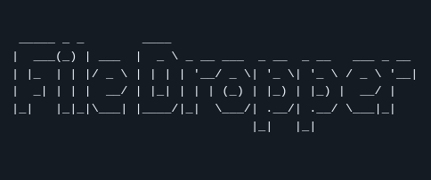
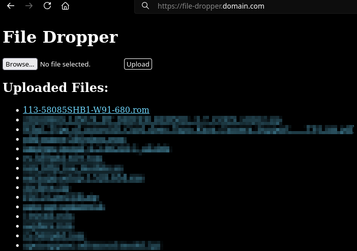
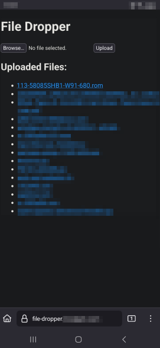

This project is on Docker Hub: https://hub.docker.com/r/goffy59/file-dropper

---

<p align="center">
  
</p>
 
> “I built this for the ones who don’t ask permission.  
> For sysadmins who live like ghosts.  
> For devs who never trusted the cloud.  
> For rebels, refugees, and the radiant few.  
> May your files move in silence. May your machines whisper only to you.”  
> — *Kateryna Sofiya Chernenko*

---
<p align="center">
  
  
</p>

---

## 🗂️ file-dropper

A minimalist, Dockerized file upload service you can self-host and trust **for simple use cases**.

**file-dropper** is a lightweight, web-based file dropbox built for devs, sysadmins, and everyday folks who just need an easy way to send or receive files—without relying on cloud storage, weird clients, or bloated services.

---

### 🚀 Features

- 🐳 **Docker-native**: Spins up in seconds via `docker run` or `compose`
- 🌐 **Web UI**: Clean interface for uploading and downloading files
- 🤝 **Works great locally**: Drop files between machines, VMs, or containers
- ⚙️ **Customizable**: Modify templates, change storage paths, tweak limits

---

### 🧠 Why It Exists

Because sometimes you just need a simple way to move a file from one machine to another.  
No signup. No login. No cloud drama.  
Just a clean dropzone in your browser that writes to disk.

Perfect for:

- Transferring logs, configs, or patches across systems
- Sending someone a file without emailing it
- Temporary local LAN setups, VM communication, or airgap bridge work

---

### 🔐 Threat Model

> _This is not Zero Trust. This is Zero Bullshit._

file-dropper is designed for **controlled environments** where you already trust the network and the people on it. Think: your LAN, your homelab, or your airgapped edge device. If you're running this exposed on the open internet without protections, you’re building a zipline over a volcano.

Security assumptions:

- No auth, no encryption, no access controls—**by design**
- Anyone who can reach the web UI can upload/download
- Files are stored **on disk**(docker volume), unencrypted, in the open
- It’s Flask behind the curtain—respect the stack

If you need auth, HTTPS, or sandboxing, wrap it in:
- A reverse proxy like Nginx or Traefik
- A container firewall or MAC policy
- Physical or network segmentation

Bottom line: **use only where you already trust the channel.** Don’t treat this like a vault. Treat it like a courier that doesn’t ask questions.

---

### 📦 Installation:
```bash
git clone https://github.com/goffy59/file-dropper.git

cd file-dropper

docker build -t file-dropper .
```

---

## 💻 Usage Examples

### 📦 Example 1: Docker CLI (w/ lsio swag network and reverse proxy)

```bash
docker run -d \
  --name file-dropper \
  --restart always \
  --net=lsio \
  --label "swag=enable" \
  --label com.centurylinklabs.watchtower.enable=false \
  -e TZ=Etc/UTC \
  -e UID=1000 \
  -e GID=1000 \
  -e FLASK_MAX_CONTENT_LENGTH=8796093022208 \
  -v /home/docker/file-dropper/app/uploads:/app/uploads \
  file-dropper
````

---

### 🔧 Example 2: Minimal Docker CLI

```bash
docker run -d \
  --name file-dropper \
  --restart always \
  -e FLASK_MAX_CONTENT_LENGTH=8796093022208 \
  -v /home/docker/file-dropper/app/uploads:/app/uploads \
  -p 8080:80 \
  file-dropper
```

---

### 🧱 Example 3: Docker Compose

```yaml
version: "3.8"

services:
  file-dropper:
    container_name: file-dropper
    image: file-dropper
    restart: always
    environment:
      - FLASK_MAX_CONTENT_LENGTH=8796093022208
    volumes:
      - /home/docker/file-dropper/app/uploads:/app/uploads
    ports:
      - 8080:80
```

---

## 🔐 Authentication

Basic HTTP Auth protects uploads and downloads.

You can customize credentials by setting environment variables in your Docker Compose file or `docker run` command:

```yaml
environment:
  - FILEDROPPER_USERNAME=myusername
  - FILEDROPPER_PASSWORD=mypassword
```

If not set, defaults are:

```text
FILEDROPPER_USERNAME = user
FILEDROPPER_PASSWORD = password
```

---

### 🐳 Example Docker run with credentials:

```bash
docker run -d \
  --name file-dropper \
  -e FILEDROPPER_USERNAME=user \
  -e FILEDROPPER_PASSWORD=password \
  -p 8080:80 \
  file-dropper
```

---

### 🚀 Accessing the Web UI

```text
http://localhost:8080/
```

Open `http://localhost:8080` in your browser. Upload a file, refresh the page, and you'll see the file listed. You can then copy the direct link to download it from other devices on your local network.

> **Tip:** Replace `localhost` with the **local IP** of the machine running the container if you're accessing it from another device.

You may need to adjust file permissions on the host system depending on your setup—your mileage may vary.

Personally, I run this behind a reverse proxy (SWAG) with a subdomain via a Cloudflared tunnel. I’ve added HTTP authentication and restricted the types of files that can be uploaded. You can tweak those restrictions in the Python app (check the `app` directory).

Feel free to modify it however you like.

---

### 📬 Questions?

If you're confused, broken, or just vibing in your lab—feel free to reach out.  
Happy home-labbing in the boring fascist dystopian future nightmare.  
**Delete the cloud. Embrace self-hosting.**

---

## 🛤️ Roadmap & Future Improvements

Here’s what’s cooking and what we want to tackle next:

- 🔐 **Better Password Storage:** Move away from plain environment variables to hashed secrets or integrate with secret managers.
- 🚀 **Performance Tweaks:** Optimize file uploads for larger files and improve concurrency handling.
- 🔄 **Auto Cleanup:** Implement automatic file expiration and cleanup policies.
- 🌍 **HTTPS Support:** Add built-in HTTPS options or tighter integration guides for reverse proxies.
- 🧩 **Plugin System:** Allow custom hooks or plugins to extend functionality (e.g., virus scanning, file type restrictions).
- 📊 **Usage Analytics:** Lightweight, privacy-respecting upload/download stats.
- 🧑‍💻 **Improved UI:** Responsive enhancements and dark mode support.
- 🛡️ **Enhanced Auth:** Support OAuth, LDAP, or token-based auth methods beyond Basic HTTP.
- ⚙️ **Configuration Profiles:** Support multiple profiles/environments for easy switching.

If you’ve got ideas or want to help out, open an issue or drop a line!

---

### ☕ Like the project? Toss a coin to your coder

If this tool saved you some time or spared you a few curses, feel free to drop a little something in the jar. No pressure—it's free, open-source, and always will be. But if you're feeling generous:

**PayPal:**  
'jack@netblues.org'

Thanks for checking out the project—whether you donate or not, you're awesome for even reading this far. 🤘

---
